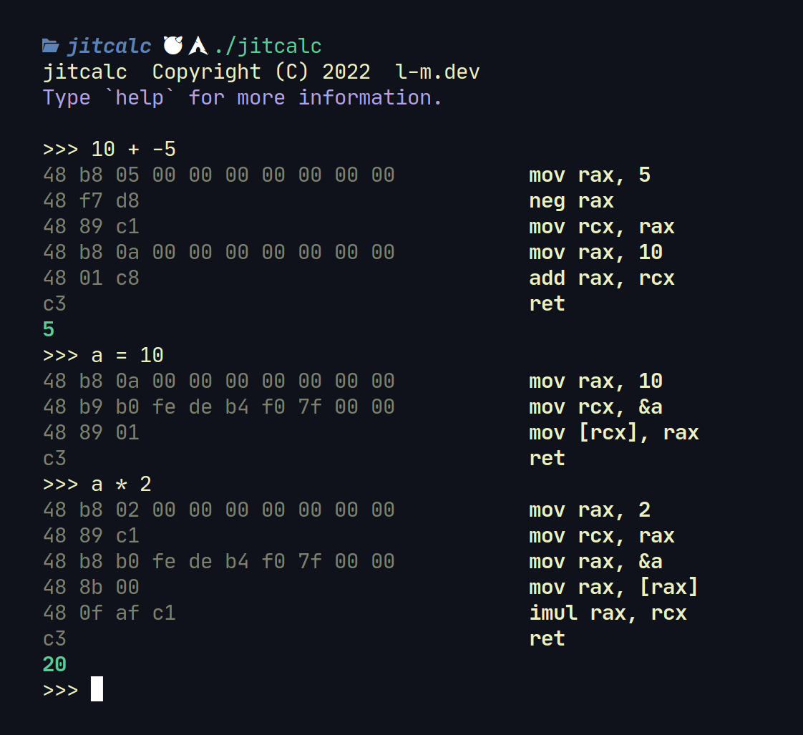
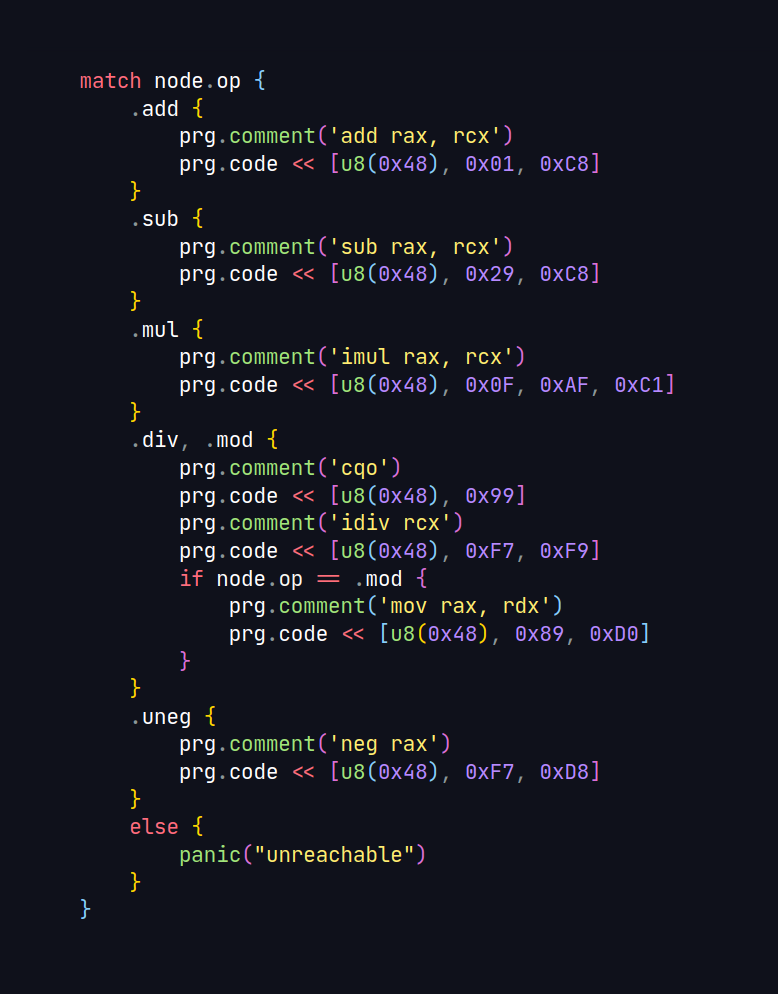

<div align="center">

# `jitcalc`



</div>

### `jitcalc` is a calculator written in the V programming language. 

What's special about it?

After parsing the input expression and generating a syntax tree, it does something different. Instead of traversing the tree interpreting the final solution, it creates a x86_64 program just in time and executes it, generating the answer.

After each line a hexdump and x86_64 assembly instructions are listed on the left. Use the `ast` command to toggle dumping the expression's AST alongside it.

Variables can be declared and assigned, and are preserved between expressions. Use the `reset` command to reset the symbol table.

### [Want to read more? Check out the article on `l-m.dev` here!](https://l-m.dev/cs/jitcalc/)

<div align="center">

# code



</div>

Constituting for about 93 lines of the program, code generation is incredibly simple. By calling the `gen()` function recursively over an entire expression tree, machine code can be generated.

```v
type Symtable = map[string]&Box[i64]

fn gen(node &Expr, mut prg JitProgram, mut symtable Symtable)!
```

About 64 lines, parsing is just as simple. Using a recursive pratt parser it can generate a syntax tree.

```v
struct Expr {
	lhs &Expr = unsafe { nil }
	rhs &Expr = unsafe { nil }
	op  Op
	val string
}

fn expr(mut l Lexer, min_bp int) !&Expr
```

49 lines, the lexer is efficient. It has the ability to look ahead by one token and is called by the parser constantly requesting tokens.

```v
enum Op { eof uneg ident assign obr cbr num add sub mul div mod }

struct Lexer {
	line string
mut:
	pos int
	tok Op
	tok_lit string
	peek Op
	peek_lit string
}

fn (mut l Lexer) next() !Op
```
